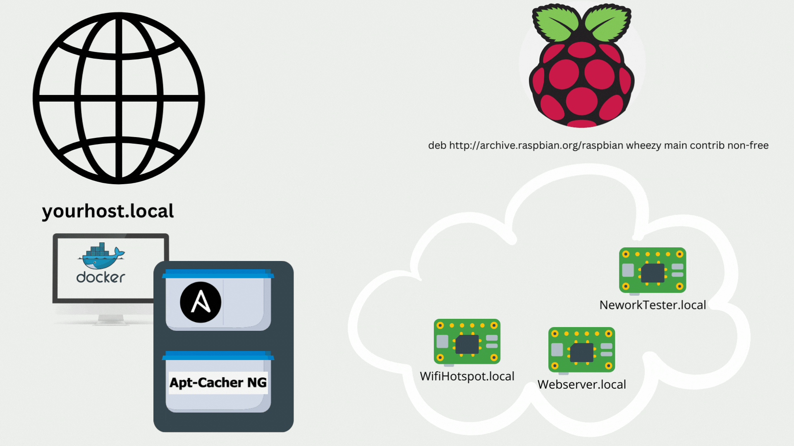
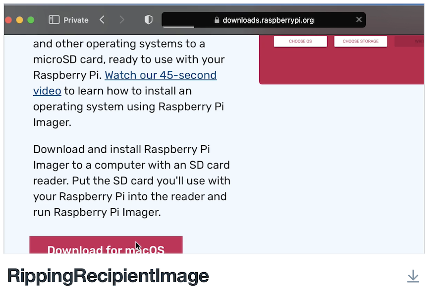
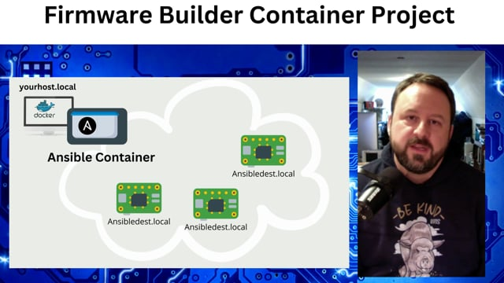

# FirmwareBuilderContainers
These are Containers for building SBC linux firmware images using ansible automation.  
- [FirmwareBuilderContainers](#firmwarebuildercontainers)
- [Project Summary](#project-summary)
- [Installation Instructions](#installation-instructions)
  - [Step 1: Clone the project in your container directory of choice:](#step-1-clone-the-project-in-your-container-directory-of-choice)
  - [Step 2: Modify the Ansible container section of the docker-compose file](#step-2-modify-the-ansible-container-section-of-the-docker-compose-file)
  - [Step 3: build and run the containers](#step-3-build-and-run-the-containers)
  - [Step 4: Attach to your containers and validate connectivity.](#step-4-attach-to-your-containers-and-validate-connectivity)
- [I want to building a cool raspberry pi project!](#i-want-to-building-a-cool-raspberry-pi-project)
  - [Cloning an example firmware image](#cloning-an-example-firmware-image)
    - [Do I want a wifi access point that extends my existing ethernet network as wifi bridge?](#do-i-want-a-wifi-access-point-that-extends-my-existing-ethernet-network-as-wifi-bridge)
    - [Do I want a wifi cybersecurity practice lab?](#do-i-want-a-wifi-cybersecurity-practice-lab)
  - [Tuning a raspberry pi to recieve your playbooks](#tuning-a-raspberry-pi-to-recieve-your-playbooks)
  - [Pushing a firmware to your target recipient](#pushing-a-firmware-to-your-target-recipient)
  - [Accessing the running pi](#accessing-the-running-pi)
- [About the Ansible Container](#about-the-ansible-container)
- [About the Apt-Cacher-NG container](#about-the-apt-cacher-ng-container)
- [Video Guide for Setting up firmware builder container project](#video-guide-for-setting-up-firmware-builder-container-project)

# Project Summary

The [docker-compose file](docker-compose.yml) will build a docker & apt-cacher-ng container.  

You can use these to accelerate your builds with playbooks that change your target device to use the local caching server as a repository.  If the cache doesn't have the file, it grabs it from the official rasbian servers.  If you have to rerun the playbook later, you won't have to wait for the download from the rasbian servers- the cache will have a copy.  

If you're not much of a reader, go to the very bottom of this page for a video that walks you through each of the steps.

# Installation Instructions

## Step 1: Clone the project in your container directory of choice:

`git clone git@github.com:CaptainMcCrank/FirmwareBuilderContainers.git`

## Step 2: Modify the Ansible container section of the docker-compose file

Find the hostname of the workstation hosting the containers.  This value needs to get passed to the containers so that your build scripts can find the apt-cacher-ng service by the hostname vended to the network.  

`hostname`

`iMac.local`

* set the DOCKER_HOST varible to reflect the hostname of your build workstation hosting the containers.

`DOCKER_HOST: "iMac.local" # Change to your hostname`

* set the docker volume variable to reflect the path where you want to host your playbook project directories.
  
`- /Users/Patrick/Development/Playbooks/MyDockerVolumes:/home/pi/Playbooks` 

(change the volume directory to whatever your user account & prefered location is.  Make sure to retain :/home/pi/Playbooks as the source directory to ensure compatibility for builders who use my [ansible hotspot project.](https://github.com/CaptainMcCrank/BuilderHotspot) 

## Step 3: build and run the containers

From within the FirmwareBuilderContainers directory, type:

`docker compose up -d`

Your containers are now running!  

## Step 4: Attach to your containers and validate connectivity.  

You can browse to the apt-cacher-ng caching server by connecting to http://localhost:3142 on your host operating system.
You can attach to the ansible container by typing 

`docker exec -it ansible bash` 

# I want to building a cool raspberry pi project!

Cool!  There are two steps.

1) Cloning an example firmware image
2) Tuning a raspberry pi to recieve your playbooks

## Cloning an example firmware image

In your host operating system, navigate to the DockerVolume playbook directory set in Step 2 for the Ansible container.  Confirm that this is the directory you specified in the [docker-compose file](docker-compose.yml).  For me, that's the following directory:

`cd ~/Development/MyDockerVolumes/`

Ok now you have to pick a project to duplicate.  Ask yourself:

### Do I want a wifi access point that extends my existing ethernet network as wifi bridge?

`git clone git@github.com:CaptainMcCrank/Transparent_Bridge_Eth_to_Wifi.git`

### Do I want a wifi cybersecurity practice lab?

`git clone https://github.com/CaptainMcCrank/Learn_Linux_Networking_And_Hacking`

Great!  Now we're ready to set up a pi to recieve a firmware image:

## Tuning a raspberry pi to recieve your playbooks

Use raspberry pi imager to build a recipient image.

Use the Raspberry Pi Operating system. 
Select the storage that's appropriate for your target sd card.

Go into the advanced settings gear button to tune the image:

1. Set the hostname to be ansibledest.local
2. Enable ssh  
3. Set a password for the pi account- **you'll need this password later when you copy the ssh key from your container to the recipient image.**
4. If you want the device to attach to wifi for it's setup, activate wifi and then enter in the SSID and credentials.  Be sure to set the wireless LAN country to the country that's appropriate. 
5. Set your locale

If any of the above was hard, check out this video:

## Pushing a firmware to your target recipient
Now attach back to your ansible container:

`docker exec -it ansible bash`

copy an ssh key to your target host: 

`ssh-copy-id pi@ansibledest.local`

Enter in the credential you specified when you created the firmware.

cd into your playbooks directory:

`cd /home/pi/Playbooks/`

change into the directory for the playbook you cloned.

push the playbook:

`ansible-playbook run.yml`

Enjoy the output!  In about 20 minutes you should have a built device.  

## Accessing the running pi

When the build completes, Power it off and the pi and then power it back on while it's physically connected to your network via ethernet.

For the Cyber lab, the [hostname is jinx.local](https://github.com/CaptainMcCrank/Learn_Linux_Networking_And_Hacking/blob/5362bc1de2514965b29e9266b66707bbae099b40/roles/system/defaults/main.yml#L12).  

For the wifi access point, the hostname by default will be a combination of the [Hostname](https://github.com/CaptainMcCrank/Transparent_Bridge_Eth_to_Wifi/blob/a8b9afaea3e1bf0aeeede8d0ccb63a25e2a23929/roles/system/defaults/main.yml#L10) and the [WifiSSID](https://github.com/CaptainMcCrank/Transparent_Bridge_Eth_to_Wifi/blob/a8b9afaea3e1bf0aeeede8d0ccb63a25e2a23929/roles/system/defaults/main.yml#L14):

wifiapworkshop.local

Note the credentials specified in the playbooks.  You can modify them if you desire before pushing the firmware to the devices!

# About the Ansible Container
One container is running ansible.  
* Attach to the container with the command docker exec -it ansible bash
* Create playbook project directories in the /home/pi/Playbooks directory
* The /etc/ansible/hosts file is tuned to push firmware to any device on the local network named "ansibledest.local".
* Validate you can reach the target system with a sample ping: `ping@ansibledest.local`
* Copy an ssh key to the target system with the command `ssh-copy-id pi@ansibledest.local` (*Note Line 14 of the [Dockerfile](ansible/Dockerfile) for your Ansible container- the key is created when you build the container.  I don't have a copy of your key :D*)
* When you're ready to deploy your project to the target type `ansible-playbook run.yml`

# About the Apt-Cacher-NG container
the second container runs apt-cacher-ng 
* It's exposed as a web server vended from the host on port.  Attach to it in a browser at either http://localhost:3142 or http://[yourhostoshostname]:3142
* You can see efficiency statistics by browsing to the web server referenced above.
* You don't really need to do much other than launch the container- but watching the stats is fun!

[This page is a placeholder till I have time to publish a real readme](https://patrickmccanna.net/container-based-builds-of-raspberry-pi-using-ansible/)

# Video Guide for Setting up firmware builder container project
I've created a video that walks through how to setup this project:

